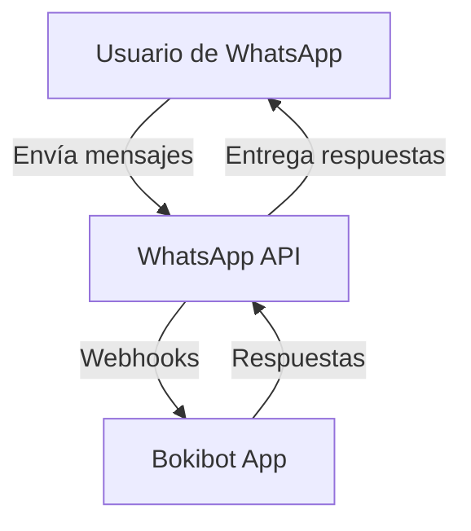
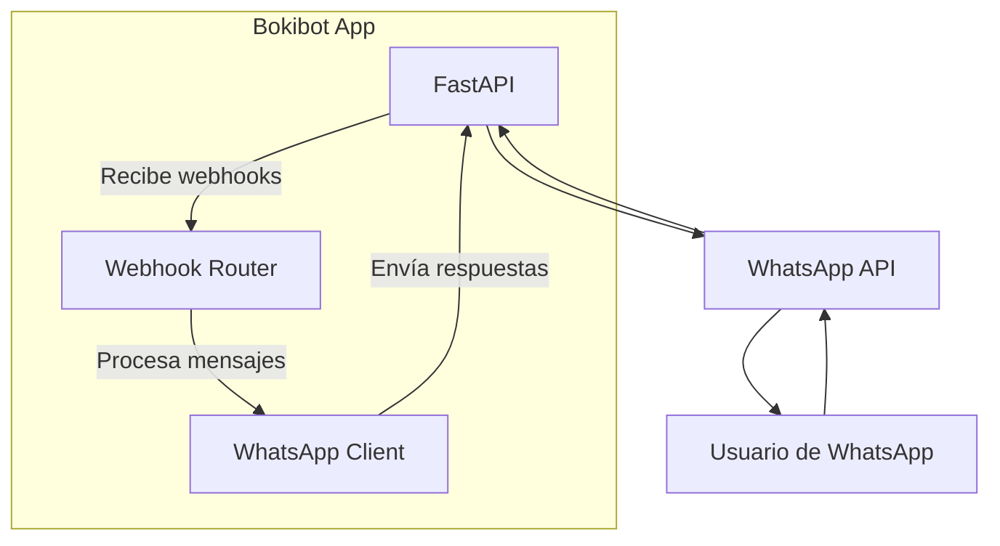
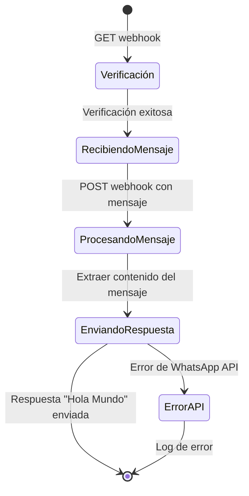

# Bokibot - Integración con WhatsApp

## Descripción

Bokibot es un servicio de mensajería integrado con WhatsApp que proporciona respuestas automáticas a los mensajes recibidos. Actualmente, la aplicación está en su fase inicial y responde con un mensaje básico de "Hola Mundo" que incluye el texto recibido.

## Arquitectura

### Diagrama C2 (Contexto)



### Diagrama C3 (Contenedores)



### Diagrama de Estado (Flujo Estándar)



## Principios y Patrones de Diseño

El proyecto implementa varios principios y patrones:

* **Arquitectura por Capas**: Separación clara entre API, servicios y modelos.
* **Principio de Responsabilidad Única (SRP)**: Cada módulo tiene una única responsabilidad (ej: `WhatsAppClient` solo maneja el envío de mensajes).
* **Inyección de Dependencias**: Uso de `get_settings()` para proporcionar configuraciones.
* **Manejo de Errores**: Captura y transformación de errores HTTP en excepciones de dominio (`WhatsAppAPIError`).
* **Modelos de Datos**: Uso de Pydantic para validación y serialización de datos.
* **Configuración Centralizada**: Variables de entorno gestionadas en un solo lugar.

## Instalación

1. **Clonar el repositorio:**
   ```bash
   git clone https://github.com/tu-usuario/boki-bot.git
   cd boki-bot
   ```

2. **Crear y activar un entorno virtual:**
   ```bash
   python3 -m venv .venv
   source .venv/bin/activate  # En Windows: .venv\Scripts\activate
   ```

3. **Instalar dependencias:**
   ```bash
   pip install -r requirements.txt
   ```

## Variables de Entorno

Crea un archivo `.env` en la raíz del proyecto con las siguientes variables:

```
# WhatsApp Cloud API (Meta)
META_BOT_TOKEN="tu_token_de_acceso"
META_NUMBER_ID="tu_id_de_numero_de_telefono"
META_VERIFY_TOKEN="tu_token_de_verificacion"
META_VERSION="v22.0"  # Versión de la Graph API (opcional)
```

## Ejecución

Para iniciar el servidor:

```bash
uvicorn app.main:app --reload
```

La aplicación estará disponible en `http://localhost:8000` y la documentación de la API en `http://localhost:8000/docs`.

## Configuración de Webhook

Para que WhatsApp envíe mensajes a tu aplicación:

1. Asegúrate de que tu servidor sea accesible públicamente (puedes usar ngrok durante el desarrollo).
2. Configura el webhook en el panel de desarrollador de Meta.
3. Usa la URL de tu aplicación seguida de `/webhook` como URL del webhook.
4. Usa el mismo token definido en `META_VERIFY_TOKEN` para la verificación.

## Desarrollo

El proyecto utiliza FastAPI y sigue una estructura modular:

- `app/main.py`: Punto de entrada de la aplicación
- `app/api/v1/webhook.py`: Manejo de webhooks de WhatsApp
- `app/services/whatsapp.py`: Cliente para enviar mensajes a WhatsApp
- `app/models/message.py`: Modelos Pydantic para estructurar los datos
- `app/core/config.py`: Configuración centralizada
